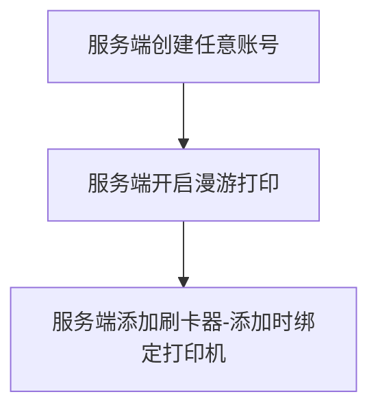
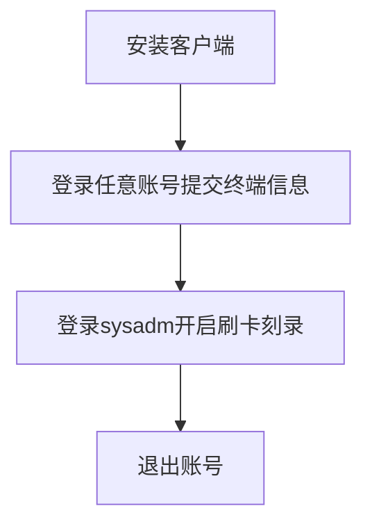
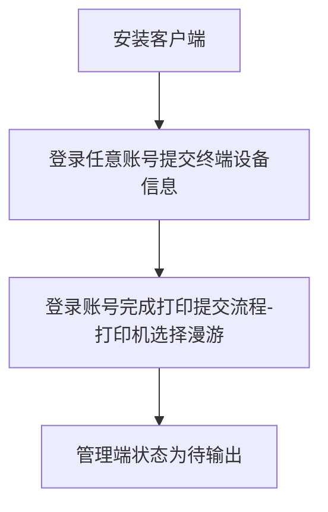
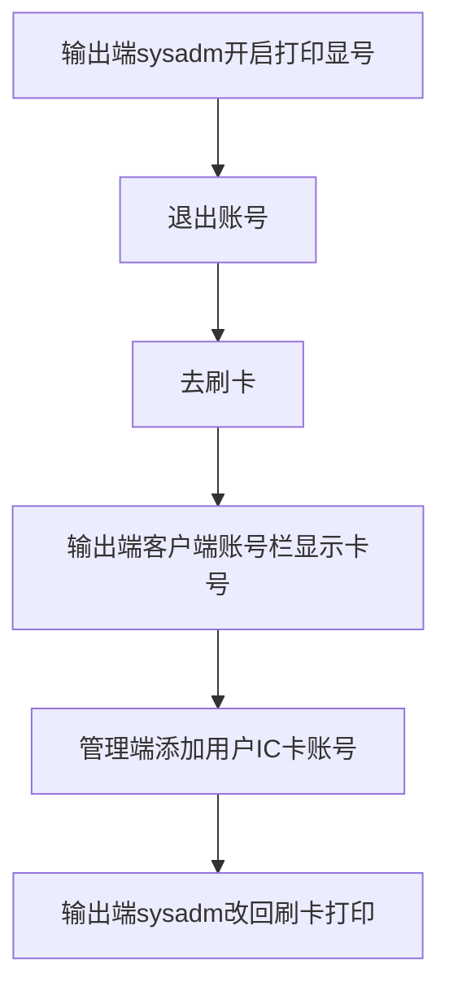
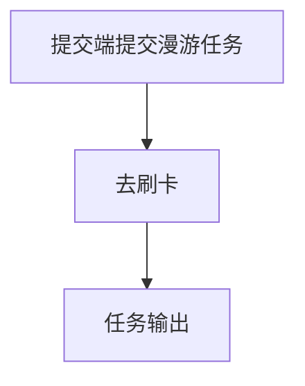

# 刷卡器配置

```
整个流程的前提是需要设置好刷卡器，比如完美的就可以使用安装ISO自带的工具设置
开启账号类型:IC卡号
update sys_accounttype set state=1 where atypeID=5;

```

## 1.服务端操作



## 2.输出端口操作



## 3.提交端口操作



## 4.刷卡器绑定



## 5.流程



    