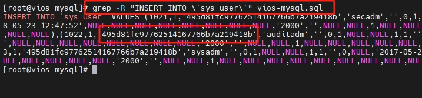
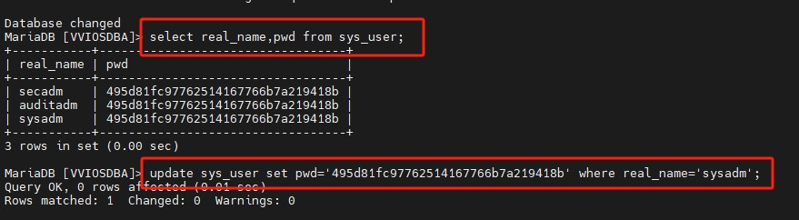

# 1.网络版忘记密码怎么办
## 1.查找sql文件
网络版的安装路径内有系统初始化时的sql文件,表,密码等初始信息就保存至其中,以 **2306** 版为例
```shell
cd /opt/vpservice/vios/bin/db   #文件结构
.
├── dm
│   ├── create_user_config.sql
│   ├── delete_user_config.sql
│   ├── delete_user_tables.sql
│   ├── dm_init.sh
│   ├── set_user_password_config.sql
│   ├── set_user_status_config.sql
│   └── vios-dm.sql
├── highgo
│   ├── create_user_table.sql
│   ├── delete_user_database.sql
│   ├── highgo_init.sh
│   ├── set_complex_rules.sql
│   └── vios-highgo.sql
├── kingbase
│   ├── create_user_table.sql
│   ├── delete_user_database.sql
│   ├── kingbase8-8.6.0.jar
│   ├── kingbase_init.sh
│   ├── sys_hba.conf
│   └── vios-kingbase.sql
├── mysql
│   ├── createUser.sql
│   ├── mysql_init.sh
│   └── vios-mysql.sql
└── oscar
    ├── alter_userpwd.sql
    ├── create_user.sql
    ├── oscar_init.sh
    └── vios-oscar.sql

```
如果使用mariadb或者mysql就查看 mysql/vios-mysql.sql文件
## 2.筛选密码密文字串
使用grep 筛选出初始化时sys_user表内容,就可以查看密文
```shell
grep -R "INSERT INTO \`sys_user\`" vios-mysql.sql
```

## 3.修改密码
> <span style="color:red">pwd=" " 密码的密文字符串根据实际查询的来,不同数据库或版本的不一样! </span>
```shell
update sys_user set pwd='????????' where real_name='sysadm';
```


## 最后
修改完成后,默认密码为 **Vsec1234**,不需要重启服务,可以直接登录