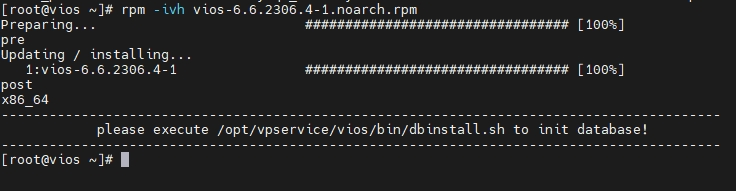
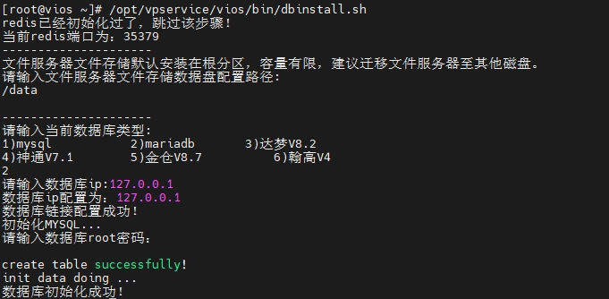
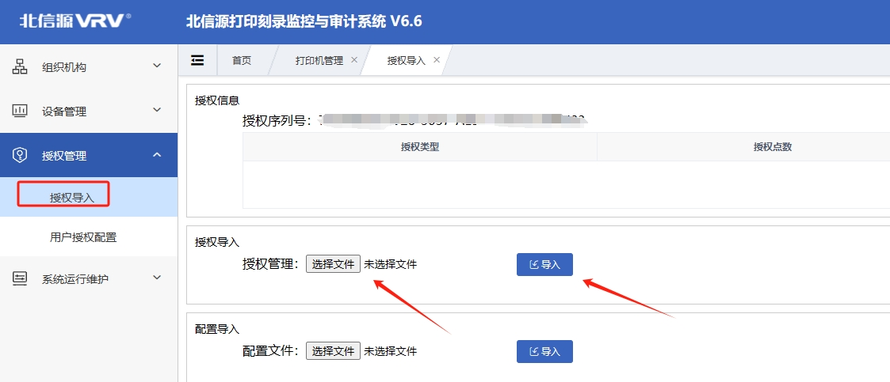
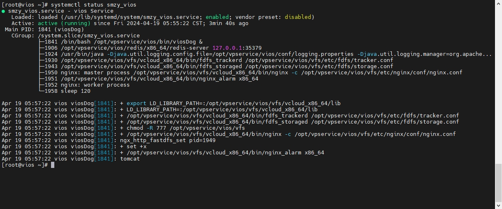

# 安装与初始化

## 1.产品安装
服务端安装包名称一般都带有noarch字样,表示没有架构要求,当然在国产化下还是需要配合导入证书和包来安装
<span style="color:red">
这里图例为centos虚拟机,国产化部署时,不要这么干
</span>


## 2.初始化
```shell
/opt/vpservice/vios/bin/dbinstall.sh
1.输入文件服务器位置 #一般选择在机械盘中
2.输入数据库类型     #默认选择mariadb数据库
3.输入数据库IP       #本机127.0.0.1
4.输入数据库密码
```

## 3.授权导入
> 登录系统 https://IP:8086/vios 账号sysadm 默认密码Vsec1234


## 4.systemd守护
```shell
systemctl status smzy_vios #查看服务
systemctl start smzy_vios  #启动
systemctl stop smzy_vios   #关闭
systemctl restart smzy_vios #重启
```

## 提示
如果你想使用centos7+虚拟机部署套来测试下,记得提前安装 **java-1.8.0-openjdk**
