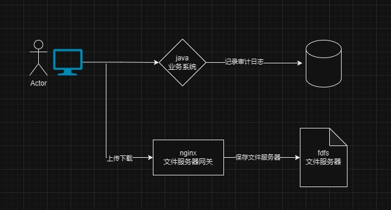

# 产品概述

---
**产品文档**: <a href="https://pan.baidu.com/s/1TjZHJGpQicdgyayjsl1FJg?pwd=6666" target="_blank">百度云盘</a>

**安装包**: <a href="链接：https://pan.baidu.com/s/1J8CKqHeOfX2cS2bHjxUP1Q?pwd=6666" target="_blank">百度云盘</a>

---

## 业务架构与流程

## 默认信息
| 类型   | 参数                           |
|------|------------------------------|
| 安装位置 | /opt/vpservice/vios          |
| 访问地址 | https://IP地址:8086/vios       |
| 账号   | sysadm \| secadm \| auditadm |
| 密码   | Vsec1234                     |

## 端口
> 防火墙或融合系统需要放行public | private不需要

| 端口号   | 作用   | 作用域    |
|-------|------|--------|
| 35105 | 文件上传下载 | public |
| 8086  | 业务访问 | public |
| 8084  | 业务   | public |
| 35379 | redis | private
| 23000 | fdfs | private
| 22122 | fdfs | private

